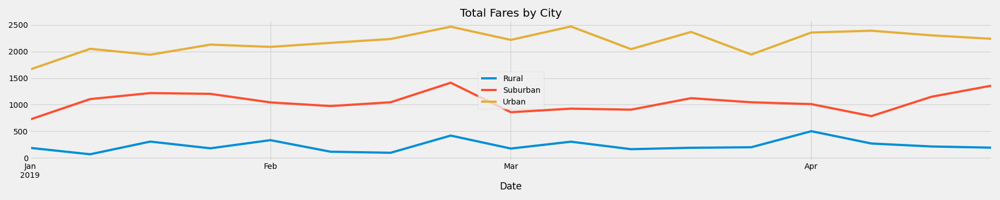

# PyBer Ride Share Analysis

## Overview
We were tasked with creating visualizations of rideshare data for PyBer to help improve access to ride-sharing services and determine affordability for underserved neighborhoods.

An analysis was conducted on ride shares from January to April 2019 for Rural, Suburban, and Urban markets at a high level.  The data includes total rides, drivers and fare data in order to look at trends and comparisons.

## Results
The data shows that a large portion of the rides and revenue is from the urban areas; however, the urban had the lowest average fare per ride and highest average far per driver at $25 and $604, respectively.

Rural areas saw the highest average fare per ride and the lowest number of rides at $35, but the lowest average fare per driver at $240.

This could be impacted by tipping or mileage.  While we do not have the data to support this assumption, there are a few assumptions that can be inferred:
1. The trip lenght for urban areas is shorter than rural or suburban.  This would increase the instances of rides and the average fare per driver, but driving down the average fare per ride.
2. Rural areas have a lower population, thus fewer instances of rides.

It does not appear that the time of year or the month is a contributing factor to the revenue as it is stable over time.

## Summary
In summary, additional information (data points) are needed to understand if accessability and affordability can be improved.   We need to understand how milage, population sizes, and tipping impact rides.  It is also recommeded to subset the high level areas into smaller neighborhoods and get socioeconomic data for each neighborhood to fully undertstand the impacts and areas of opportunity for underserved locations.

